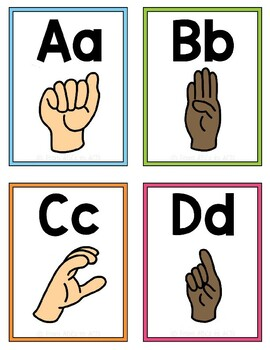
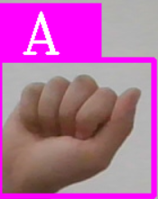
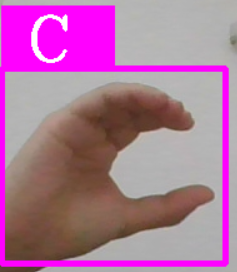

# Hand Sign Detection Project (American Sign Language)

## Description
Le projet Hand Sign Detection est une application de détection et de classification des signes de la main utilisant Computer Vision. Il est spécifiquement conçu pour détecter les formes des mains dans le contexte de la Langue des Signes Américaine (ASL). L'objectif principal est de repérer les signes de l'alphabet américain (A, B, C, D) effectués avec les mains.



## Fonctionnalités
* Détection en temps réel des signes de la main dans une séquence vidéo.
* Extraction précise des régions de la main à partir des images capturées.
* Classification des formes des mains en fonction des lettres de l'alphabet américain.
* Affichage des lettres classifiées avec des boîtes entourant les régions de la main.

## Instructions d'utilisation
1. Étapes d'installation
   * Clonez le dépôt depuis GitHub :
     ```bash
          git clone https://github.com/Ellouze-Houcem/Hand-sing-Detection.git
   * Accédez au répertoire du projet :
     ```bash
          cd Hand-sing-Detection
   * Installez les dépendances :
     ```bash
          pip install -r requirements.txt
2. Comment exécuter le code
    * Lancez le script principal :
       ```bash
         python program.py
     * Assurez-vous que votre caméra est activée et orientée vers vos mains.
3. Structure du projet :
    * Model/: Contient le modèle de classification et les fichiers associés.
    * DataCollection: Ce fichier implémente une fonctionnalité de détection et de suivi des mains en temps réel à partir de la caméra par défaut. Il offre la possibilité à l'utilisateur d'enregistrer des images des mains détectées en appuyant sur la touche 's'.
    * program.py: Script principal pour l'exécution du projet.

## Exemple
   
 
